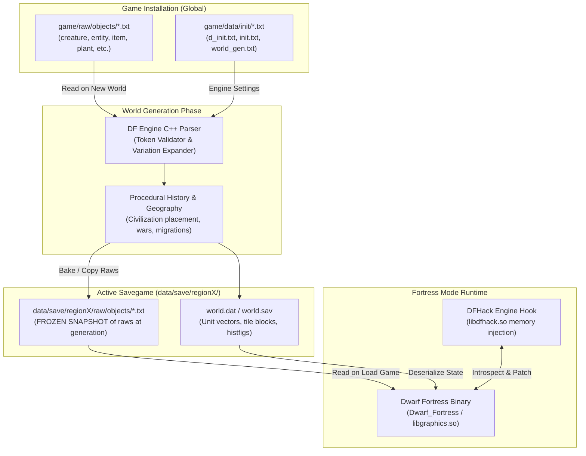
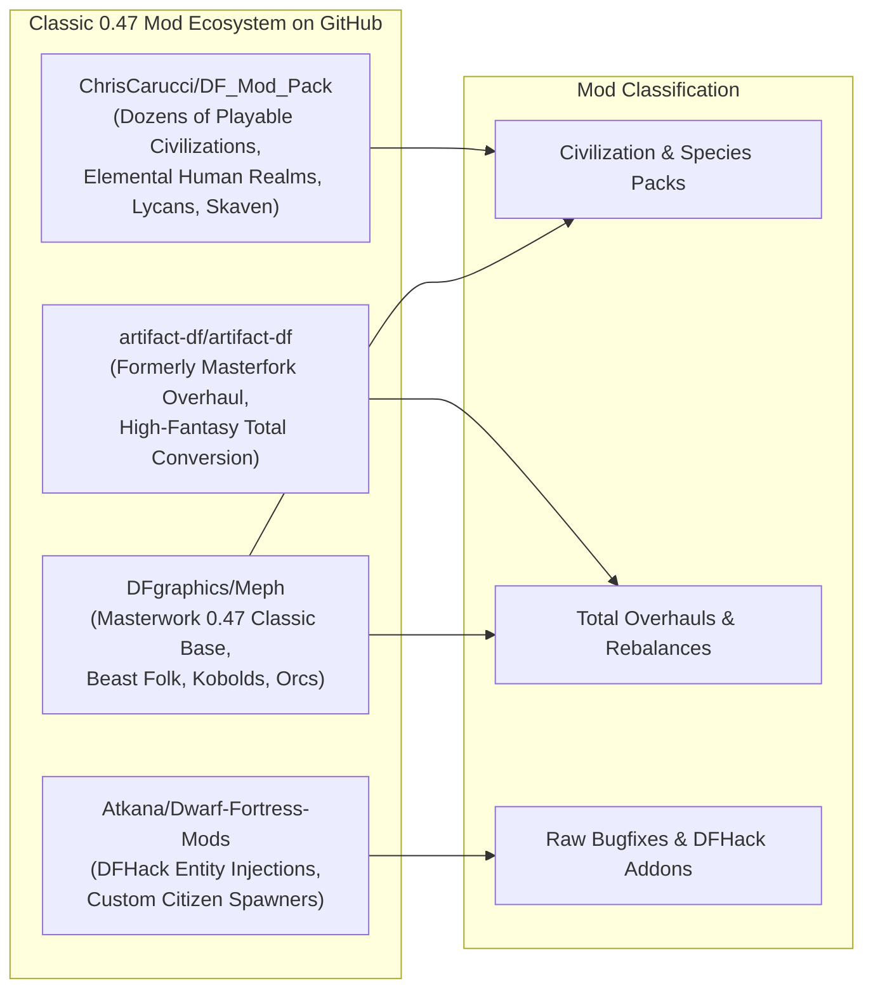
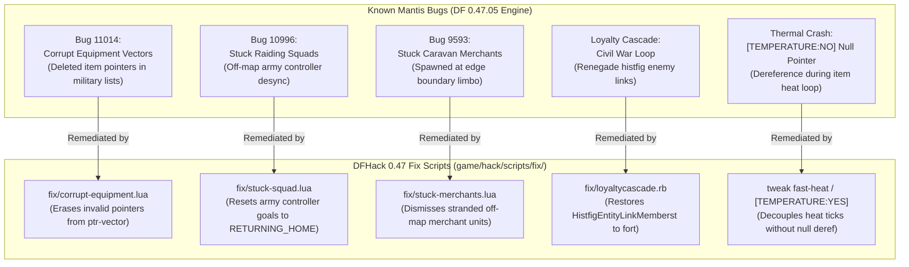
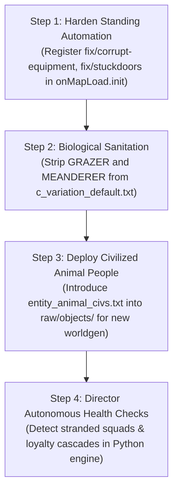

# Deep Research Report: Dwarf Fortress v0.47.05 Classic Architecture, RAW System Mechanics, Unofficial Patches, and Animal People Civilizations

**Document Version:** 1.0.0  
**Target Platform:** Dwarf Fortress Classic v0.47.05-r8 (Linux x86_64)  
**Author:** Antigravity Autonomous Agent  
**Context:** Research and reference report prepared for Claude and the Antfarm autonomous fortress engineering team.  
**Date:** September 2026  

---

## Table of Contents
1. [Executive Summary & Historical Context](#1-executive-summary--historical-context)
2. [The "Weird Text Files": Architecture of the Dwarf Fortress RAW Engine](#2-the-weird-text-files-architecture-of-the-dwarf-fortress-raw-engine)
   - 2.1 File System Organization & Load Order
   - 2.2 Base Raws vs. Savegame Raws (The "Bake-in" Architecture)
   - 2.3 Syntax, Encoding, and Parsing Rules
   - 2.4 Object Types and Core Declarations
   - 2.5 Creature Variations and Macro Expansion
3. [Animal People in Dwarf Fortress 0.47: Mechanics, Flaws, and Civilization Modding](#3-animal-people-in-dwarf-fortress-047-mechanics-flaws-and-civilization-modding)
   - 3.1 The Vanilla Implementation & Tarn Adams' Unfinished Code
   - 3.2 Critical Vanilla Biological Traps (Grazer, Size, Meanderer)
   - 3.3 Anatomy of an Animal Person Civilization (Entity Tokens)
   - 3.4 Step-by-Step Blueprint for Creating Playable Animal People Civilizations
4. [Ecosystem of 0.47 Mods & GitHub Repositories](#4-ecosystem-of-047-mods--github-repositories)
   - 4.1 Chris Carucci's DF Mod Pack (`ChrisCarucci/DF_Mod_Pack`)
   - 4.2 Artifact DF / Masterfork Overhaul (`artifact-df/artifact-df`)
   - 4.3 Atkana's Creature and Entity Extensions (`Atkana/Dwarf-Fortress-Mods`)
   - 4.4 Masterwork Dwarf Fortress (Meph 0.47.05 Classic Edition)
   - 4.5 Community Animal People Standalone Releases (DFFD & Bay 12)
5. [Bug Reports, Engine Exploits, and Unofficial Patches](#5-bug-reports-engine-exploits-and-unofficial-patches)
   - 5.1 The Bay 12 Mantis Bug Tracker: Critical 0.47.05 Engine Flaws
   - 5.2 DFHack Unofficial Patch Suite (`fix/*` Scripts)
   - 5.3 Memory and Thermal Stability Pitfalls (`tweak fast-heat`, Temperature Crashes)
6. [Strategic Implementation Guide for the Antfarm Autonomous Agent](#6-strategic-implementation-guide-for-the-antfarm-autonomous-agent)
7. [Comprehensive Bibliography and Source Citations](#7-comprehensive-bibliography-and-source-citations)

---

## 1. Executive Summary & Historical Context

On **January 28, 2021**, Bay 12 Games released **Dwarf Fortress v0.47.05**. This release marked the final update to the venerable classic ASCII/2D branch of Dwarf Fortress that had been developed continuously for nearly two decades. Following this release, Tarn Adams (Toady One) and Zach Adams pivoted their entire development focus to the v50 Steam/Itch.io Premium Edition, which fundamentally rebuilt the graphical presentation, user interface, input system, and internal file architecture.

Because the classic 0.47 branch was left in this frozen state, it represents an immutable, historic milestone in software engineering. However, it also left behind hundreds of unpatched engine-level bugs, half-implemented game features, and incomplete entity definitions. For players and autonomous systems (such as Antfarm) operating within this legacy classic environment, game maintenance, performance enhancement, and content expansion rely entirely on:
1. **The RAW Modding System:** Modifying the declarative text database files that define entities, creatures, reactions, and items.
2. **DFHack (The Unofficial Runtime Engine):** Injecting runtime memory patches, event hooks, and automated fix scripts to bypass hardcoded C++ engine limitations.

This report provides a exhaustive technical investigation into how the RAW engine operates under the hood, how bug fixes are applied without source code, and how community modders on GitHub and Bay 12 Games created fully civilized, playable animal people kingdoms out of the unfinished scraps left behind in 0.47.05.

---

## 2. The "Weird Text Files": Architecture of the Dwarf Fortress RAW Engine

Dwarf Fortress does not store its world data, entity definitions, or creature biology in compiled binary formats or relational databases. Instead, it relies on a proprietary, flat-text declarative database system colloquially known as **"The RAWS"**.



### 2.1 File System Organization & Load Order
Within our Dwarf Fortress installation directory (`/home/ekco/github/dwarffortress/game/`), the RAW files are located in:
```
game/raw/
├── graphics/          # Graphics tile associations (Phoebus, Ironhand, etc.)
├── interaction_examples/
├── objects/           # THE CORE DECLARATIVE DATABASE
│   ├── b_detail_plan_default.txt   # Body detail plans (tissues, hair, nails)
│   ├── body_default.txt            # Structural skeletal templates (humanoid, quadruped)
│   ├── c_variation_default.txt     # Creature variation macro templates
│   ├── creature_*.txt              # All biological creatures (24 files)
│   ├── descriptor_*.txt            # Colors, patterns, shapes
│   ├── entity_default.txt          # Civilizations, ethics, government positions
│   ├── inorganic_*.txt             # Metals, stones, gems, soils
│   ├── item_*.txt                  # Weapons, armor, tools, siege ammo
│   ├── language_*.txt              # Dictionaries (Dwarf, Elf, Human, Goblin)
│   ├── material_template_default.txt# Thermodynamic & physical material profiles
│   ├── plant_*.txt                 # Crops, trees, shrubs, grasses
│   ├── reaction_*.txt              # Workshop recipes and custom smelter reactions
│   └── tissue_template_default.txt # Skin, muscle, bone, eye tissue attributes
└── text/              # Procedural book titles, poem structures, musical forms
```

### 2.2 Base Raws vs. Savegame Raws (The "Bake-in" Architecture)
One of the most frequent points of confusion for newcomers is why modifying a file in `game/raw/objects/` does not change an existing fortress or world:
* **Base Raws (`game/raw/objects/`):** These serve exclusively as the template for **new world generation**. When you click "Create New World", the engine reads these files.
* **Savegame Raws (`game/data/save/regionX/raw/objects/`):** During world generation, the engine creates a standalone copy of every raw file and bakes it directly into the region save folder.
* **The Rule of Persistence:** Once a world is generated, the game **never reads `game/raw/objects/` again for that world**. All live fortress sessions, adventure sessions, and legends exports read strictly from `game/data/save/regionX/raw/objects/`.
* **Dynamic Modding in Running Forts:** To modify creature attributes, fix broken tokens, or add custom workshop reactions to an *existing* game, modders must edit the files inside `game/data/save/regionX/raw/objects/`. Note that certain structural additions (such as registering an entirely new civilization entity) will not spawn new civilizations into a world whose history has already been fully simulated, though reactions, item properties, and creature variations will update immediately.

### 2.3 Syntax, Encoding, and Parsing Rules
The Dwarf Fortress parser is written in C++ and operates on strict declarative token streams. It obeys the following syntactic rules:

1. **Token Syntax (`[TAG:ARG1:ARG2:...]`):**
   - Every declaration begins with an open square bracket `[` and ends with a closing bracket `]`.
   - The primary verb/identifier is the first token, followed by colon-separated parameters.
   - Example: `[ARMOR:ITEM_ARMOR_BREASTPLATE:COMMON]` declares armor access, pointing to an item ID, with an entity rarity of `COMMON`.
2. **Whitespace and Indentation:**
   - The parser is **indent-agnostic**: tabs, spaces, and leading indentation are stripped and discarded.
   - The parser is **line-break sensitive**: raw tags must generally appear on their own lines. If multiple tags are crammed onto one line without proper line separators in certain blocks (such as body detail plans or tissue definitions), the parser can silently drop the following tokens.
3. **Bracket Matching & Silent Failure:**
   - If a bracket is missing (e.g. `[CREATURE:DWARF`), the parser will either crash with a memory fault during load or fail to parse every tag downstream until the next bracket is encountered.
4. **Encoding (Strict CP437 Extended ASCII):**
   - Dwarf Fortress was built on classic DOS character routines. All text files must be encoded in **CP437 (IBM PC Extended ASCII)** or single-byte ANSI.
   - If a modern UTF-8 file containing multi-byte characters (such as accented letters `é`, `ü`, or em-dashes) is introduced without proper encoding, names will be corrupted with replacement glyphs (e.g., `├⌐`), or the C++ parser will abort during string length calculations.
5. **Header Validation:**
   - Every raw file must contain its exact filename (without extension) on line 1, followed by a blank line, followed by the object type header (e.g. `[OBJECT:CREATURE]` or `[OBJECT:ENTITY]`). Any text preceding the `[OBJECT:...]` header is treated as a comment.

### 2.4 Object Types and Core Declarations
The primary top-level `[OBJECT:...]` categories recognized by the engine:
- `[OBJECT:CREATURE]`: Physical beings, anatomy, caste definitions, body size curves, attacks, and natural behaviors.
- `[OBJECT:ENTITY]`: Cultures, tribes, and civilizations. Controls playable status (`[SITE_CONTROLLABLE]`), diplomacy, jobs, ethics, starting weapons, and royal nobility positions.
- `[OBJECT:ITEM]`: Manufactured equipment including weapons, armor, helm, pants, shoes, tools, and toys.
- `[OBJECT:INORGANIC]`: Geological strata, minerals, ores, precious gems, and smeltable metals.
- `[OBJECT:MATERIAL_TEMPLATE]`: Mechanical and thermal physics profiles (impact yield, shear fracture, boiling point, specific heat capacity).
- `[OBJECT:REACTION]`: Custom crafting recipes executed at workshops (smelter, craftsdwarf workshop, custom mod buildings).
- `[OBJECT:BODY]` & `[OBJECT:BODY_DETAIL_PLAN]`: Anatomical hierarchies (torso -> neck -> head -> eyes) and tissue layering (skin over fat over muscle over bone).

### 2.5 Creature Variations and Macro Expansion
To eliminate code duplication across hundreds of creatures, the engine supports a powerful macro system defined in `c_variation_default.txt` under `[OBJECT:CREATURE_VARIATION]`.

Creature variations allow modders to apply systematic mutations to base animals. For example, a base animal (like a Badger or Bear) can be transformed into a giant version or a bipedal humanoid using `[APPLY_CREATURE_VARIATION:ANIMAL_PERSON]`.

The variation engine operates using three fundamental macro verbs:
1. `[CV_REMOVE_TAG:<TAG>]`: Strips an existing tag from the base creature.
2. `[CV_CONVERT_TAG]`: Replaces an existing anatomical or behavioral token with another. For example, changing a quadruped body plan into a humanoid body plan:
   ```txt
   [CV_CONVERT_TAG]
       [CVCT_MASTER:BODY]
       [CVCT_TARGET:QUADRUPED]
       [CVCT_REPLACEMENT:HUMANOID]
   ```
3. `[CV_NEW_TAG:<TAG:ARGS>]`: Injects new capabilities, such as sapience, language, and door manipulation:
   ```txt
   [CV_NEW_TAG:CAN_LEARN]
   [CV_NEW_TAG:CAN_SPEAK]
   [CV_NEW_TAG:CANOPENDOORS]
   [CV_NEW_TAG:EQUIPS]
   ```

**Engine Execution Order:** In `c_variation_default.txt`, removal tags are evaluated from the bottom up, convert tags are evaluated from the bottom up, and new tags are injected from the top down.

---

## 3. Animal People in Dwarf Fortress 0.47: Mechanics, Flaws, and Civilization Modding

One of the most frequent requests in the Dwarf Fortress community is the ability to play as or interact with thriving civilizations of **Animal People** (e.g. Wolf Men, Raven Men, Tiger Men, Elephant Men). 

### 3.1 The Vanilla Implementation & Tarn Adams' Unfinished Code
In vanilla 0.47.05, animal people exist in large quantities (defined across 24 different creature files), but they are fundamentally second-class citizens in world generation.

When inspecting `game/raw/objects/entity_default.txt` at line 1899, one discovers that Tarn Adams began implementing subterranean animal civilizations, but abandoned it mid-development:

```txt
[ENTITY:SUBTERRANEAN_ANIMAL_PEOPLES]
	[LAYER_LINKED]
	[CREATURE:AMPHIBIAN_MAN]
	[CREATURE:REPTILE_MAN]
	[CREATURE:SERPENT_MAN]
	[CREATURE:RODENT MAN]
	[CREATURE:BAT_MAN]
	[CREATURE:ANT_MAN]
	[CREATURE:OLM_MAN]
	[CREATURE:CAVE_SWALLOW_MAN]
	[CREATURE:CAVE_FISH_MAN]
	[WEAPON:ITEM_WEAPON_SPEAR]
	[WEAPON:ITEM_WEAPON_BLOWGUN]
		[AMMO:ITEM_AMMO_BLOWDARTS]
	[SHIELD:ITEM_SHIELD_SHIELD]
	[SHIELD:ITEM_SHIELD_BUCKLER]
	[WOOD_WEAPONS]
	[WOOD_ARMOR] shields
	[USE_ANY_PET_RACE]
	[INDOOR_WOOD]
	[USE_CAVE_ANIMALS]
	[USE_ANIMAL_PRODUCTS]
	[EQUIPMENT_IMPROVEMENTS]
	[FRIENDLY_COLOR:1:0:1]
	no site or biome or attack info for now
	[MAX_STARTING_CIV_NUMBER:100] all irrelevant right now
	[MAX_POP_NUMBER:10000]
	[MAX_SITE_POP_NUMBER:120]
	...
	*** ethics copied from kobolds for now
	...
	*** later
```

Because of this incomplete state:
* There are **no surface animal civilizations** in vanilla.
* Subterranean animal people only appear as unorganized tribal skirmishers or solitary wilderness creatures.
* They lack towns, hillocks, tree cities, trade caravans, diplomats, or siege warfare capabilities.
* They cannot be selected at the fortress mode embark screen.

### 3.2 Critical Vanilla Biological Traps (Grazer, Size, Meanderer)
When modders attempt to make animal people playable or bring them into fortress mode, they run into three severe engine bugs inherited from base animal raws:

#### Trap 1: The Deadly Grazer Starvation Bug
In `c_variation_default.txt`, the `[CREATURE_VARIATION:ANIMAL_PERSON]` block removes dozens of vermin and animal tokens, but it **forgets to remove `[GRAZER]` and `[STANDARD_GRAZER]`**:
* Any base herbivore animal (Elephant, Rhinoceros, Deer, Sheep, Horse, Kangaroo, Cow) possesses a grazer coefficient scaled to its body mass.
* When converted to an animal person, the creature retains the need to graze.
* Even though an Elephant Man has hands, sapience, and can carry cooked lavish meals in a backpack, **their digestive system requires them to consume live grass/moss tiles continuously**.
* If an Elephant Man joins your fortress as a mercenary, visitor, or citizen, and remains inside an underground workshop or stone room, **they will starve to death within weeks** while surrounded by masterwork food.
* **The Modding Fix:** Add `[CV_REMOVE_TAG:GRAZER]` and `[CV_REMOVE_TAG:STANDARD_GRAZER]` to `[CREATURE_VARIATION:ANIMAL_PERSON]` in `c_variation_default.txt`.

#### Trap 2: Body Size Discrepancies and Armor Incompatibility
* Vanilla dwarfs have an adult body volume of **60,000 cm³**.
* Vanilla humans have an adult body volume of **70,000 cm³**.
* In `c_variation_default.txt`, animal people have `[CV_NEW_TAG:GRAVITATE_BODY_SIZE:70000]`. This pulls their size towards human scale, but does not equalize it.
* A Sparrow Man is far smaller than 60,000 cm³, while an Elephant Man or Sperm Whale Man is enormous.
* In Dwarf Fortress, armor must fit a creature's size. Standard armor forged by dwarfs is tagged `(dwarven)` and only fits creatures sized 54,000 to 66,000 cm³. Large or small animal people can never wear captured dwarven, human, or goblin armor.
* **The Modding Fix:** Animal person civilizations must be permitted `[ARMOR:...]` and forge jobs so they forge custom armor specifically sized for their species.

#### Trap 3: The Meanderer Paralysis
Certain base animals (e.g. Sloths, Tortoises, Snails) have the `[MEANDERER]` token, causing them to wander aimlessly and pause for hundreds of frames between actions. If not stripped, a Sloth Man citizen will take two full seasons to walk from their bedroom to the trade depot.
* **The Modding Fix:** Add `[CV_REMOVE_TAG:MEANDERER]` to `c_variation_default.txt`.

### 3.3 Anatomy of an Animal Person Civilization (Entity Tokens)
To transform wild animal people into an organized civilization capable of trading, fighting, and being played in Fortress Mode, a modder must construct a full `[ENTITY:...]` block. The following tokens are required:

| Token | Function | Engine Impact |
| --- | --- | --- |
| `[SITE_CONTROLLABLE]` | Enables Fortress Mode embark. | Replaces legacy `[CIV_CONTROLLABLE]` (pre-0.42). Allows player to pick this civ on the world embark screen. |
| `[ALL_MAIN_POPS_CONTROLLABLE]` | Unlocks all citizen castes. | Ensures player has direct control over workers and military. |
| `[CREATURE:<ID>]` | Designates member species. | Can declare a single species (e.g. `[CREATURE:WOLF_MAN]`) or dozens of species for a cosmopolitan beast empire. |
| `[DEFAULT_SITE_TYPE:TREE_CITY]` | Architectural architecture. | Can be `TREE_CITY` (elven style), `CITY` (human towns), or `DARK_FORTRESS` (goblin towers). |
| `[START_BIOME:<BIOME>]` | World generation homeland. | Defines where their capital spawns (e.g. `FOREST_TEMPERATE`, `SAVANNA`). |
| `[BIOME_SUPPORT:<BIOME>:<N>]` | Expansion capacity. | Determines how aggressively the civilization spreads into surrounding biomes. |
| `[MAX_STARTING_CIV_NUMBER:N]` | Historical density. | Number of independent civilizations of this race generated during year 1. |
| `[ACTIVE_SEASON:<SEASON>]` | Trade caravan schedules. | `[ACTIVE_SEASON:AUTUMN]` (dwarfs), `[ACTIVE_SEASON:SPRING]` (elves), `[ACTIVE_SEASON:SUMMER]` (humans). |
| `[COMMON_DOMESTIC_PACK]` | Caravan pack animals. | Allows their merchants to haul goods on yaks, llamas, or camels. |
| `[ETHIC:<CRIME>:<RESPONSE>]` | Moral and judicial system. | Dictates relations with other races. If `[ETHIC:KILL_NEUTRAL:REQUIRED]`, they will be at permanent war with all others. |

### 3.4 Step-by-Step Blueprint for Creating Playable Animal People Civilizations

To implement playable Animal People in Dwarf Fortress 0.47.05 without breaking existing saves or base raws:

1. **Patch `c_variation_default.txt`:**
   Insert the missing removal tags inside `[CREATURE_VARIATION:ANIMAL_PERSON]`:
   ```txt
   [CV_REMOVE_TAG:GRAZER]
   [CV_REMOVE_TAG:STANDARD_GRAZER]
   [CV_REMOVE_TAG:MEANDERER]
   ```
2. **Create a Dedicated Entity Raw File (`raw/objects/entity_animal_civs.txt`):**
   Create a new file rather than modifying `entity_default.txt` to prevent syntax merge errors:
   ```txt
   entity_animal_civs

   [OBJECT:ENTITY]

   [ENTITY:ANIMAL_PEOPLE_FOREST]
       [SITE_CONTROLLABLE]
       [ALL_MAIN_POPS_CONTROLLABLE]
       [CREATURE:WOLF_MAN]
       [CREATURE:BEAR_MAN]
       [CREATURE:BADGER_MAN]
       [CREATURE:DEER_MAN]
       [CREATURE:RAVEN_MAN]
       [DEFAULT_SITE_TYPE:TREE_CITY]
       [START_BIOME:FOREST_ANY]
       [BIOME_SUPPORT:FOREST_ANY:3]
       [BIOME_SUPPORT:SAVANNA:2]
       [MAX_STARTING_CIV_NUMBER:15]
       [MAX_POP_NUMBER:10000]
       [MAX_SITE_POP_NUMBER:120]
       [ACTIVE_SEASON:SUMMER]
       [COMMON_DOMESTIC_PACK]
       [COMMON_DOMESTIC_PULL]
       [USE_ANY_PET_RACE]
       [WOOD_WEAPONS]
       [WOOD_ARMOR]
       [PERMITTED_JOB:CARPENTER]
       [PERMITTED_JOB:WOODCUTTER]
       [PERMITTED_JOB:MASON]
       [PERMITTED_JOB:METALSPLITTER]
       [PERMITTED_JOB:WEAPONSMITH]
       [PERMITTED_JOB:ARMORER]
       [WEAPON:ITEM_WEAPON_BOW]
           [AMMO:ITEM_AMMO_ARROWS]
       [WEAPON:ITEM_WEAPON_SPEAR]
       [WEAPON:ITEM_WEAPON_AXE_BATTLE]
       [WEAPON:ITEM_WEAPON_SWORD_SHORT]
       [ARMOR:ITEM_ARMOR_LEATHER:COMMON]
       [ARMOR:ITEM_ARMOR_COAT:COMMON]
       [HELM:ITEM_HELM_CAP:COMMON]
       [GLOVES:ITEM_GLOVES_GLOVES:COMMON]
       [SHOES:ITEM_SHOES_BOOTS:COMMON]
       [PANTS:ITEM_PANTS_LEGGINGS:COMMON]
       [SHIELD:ITEM_SHIELD_SHIELD]
       [ETHIC:KILL_ENTITY_MEMBER:PUNISH_CAPITAL]
       [ETHIC:KILL_NEUTRAL:UNTHINKABLE]
       [ETHIC:KILL_ENEMY:ACCEPTABLE]
       [ETHIC:THEFT:PUNISH_SERIOUS]
       [ETHIC:EAT_SAPIENT_OTHER:UNTHINKABLE]
   ```

---

## 4. Ecosystem of 0.47 Mods & GitHub Repositories

Because classic Dwarf Fortress modding was decentralized across the Bay 12 Forums and Dwarf Fortress File Depot (DFFD), developers increasingly turned to GitHub during the 2018-2022 era to collaborate on massive total conversion mods and raw repositories.

Below is an annotated catalog of the major open-source repositories and mod collections built specifically for Dwarf Fortress 0.47.05:



### 4.1 Chris Carucci's DF Mod Pack (`ChrisCarucci/DF_Mod_Pack`)
* **Author:** Chris Carucci (Community handle: *AbioGenLaughingMan*)
* **Repository Link:** `https://github.com/ChrisCarucci/DF_Mod_Pack`
* **Target Version:** Dwarf Fortress 0.47.04 / 0.47.05
* **Core Significance:** This is one of the most comprehensive community collections specifically dedicated to adding diverse playable civilizations and sentient species to Dwarf Fortress.
* **Key Civilizations Included:**
  - **Boarth:** Mountain-dwelling boar-folk with advanced bronze metallurgy.
  - **Blendec:** Bipedal horned goat people with specialized domestic war beasts and unique pastoral workshops.
  - **Myce:** Underground and forest-dwelling halfling/rodent folk with burrowing mechanics.
  - **Lycans & Centaurs:** Savage, aggressive beast-humanoid tribes with high combat speed and natural attacks.
  - **Skaven:** Complete underground rat-folk civilizations with custom disease weapons and scavenging jobs.
  - **Five Elemental Human Empires:** The Tide Kingdom (coastal), Frost Dominion (glacier/tundra), Thunder Realm (savage plains), Flame Empire (volcanic), and Stone Realm (deep mountain peaks).
* **Architecture:** The repository is cleanly structured into modular raw folders, making it easy to isolate specific `entity_*.txt` files and import individual species into a vanilla game.

### 4.2 Artifact DF / Masterfork Overhaul (`artifact-df/artifact-df`)
* **Author / Team:** The Artifact DF Project Team (formerly Masterfork)
* **Repository Link:** `https://github.com/artifact-df/artifact-df`
* **Target Version:** Dwarf Fortress 0.47.05 (with later Steam adaptations)
* **Core Significance:** Originally conceived as "Masterfork" (a modern rewrite of Meph's legendary Masterwork Dwarf Fortress), this project completely redesigned the high-fantasy overhaul experience. To prevent confusion with the original Masterwork codebase, it was formally rebranded as **Artifact DF**.
* **Key Features:**
  - Complete overhaul of vanilla creature files, fixing biological tokens and body size scalings across all animal people.
  - Introduction of unique beast civilizations, magical guilds, and deep-cavern empires.
  - Over 50 new custom reactions and workshops that do not conflict with vanilla DFHack scripts.
  - Integrated graphics definitions tailored for classic TWBT and ASCII print modes.

### 4.3 Atkana's Creature and Entity Extensions (`Atkana/Dwarf-Fortress-Mods`)
* **Author:** Atkana
* **Repository Link:** `https://github.com/Atkana/Dwarf-Fortress-Mods`
* **Target Version:** Dwarf Fortress 0.47.05
* **Core Significance:** Rather than just editing raw text files, Atkana combines DFHack Lua scripts with raw definitions to dynamically manipulate civilizations and citizen rosters in running games.
* **Key Components:**
  - Custom scripts to change the playable civilization type of an active fortress.
  - In-game spawner scripts to force animal people migrants to arrive with full citizenship rights, bypassing the vanilla visitor/resident probation period.
  - Patches for entity ethics that prevent loyalty cascades during tavern brawls.

### 4.4 Masterwork Dwarf Fortress (Meph 0.47.05 Classic Edition)
* **Author:** Meph & Community Contributors
* **Repository / DFFD Link:** `https://github.com/DFgraphics/Meph` / DFFD Category #3
* **Target Version:** Dwarf Fortress 0.47.05
* **Core Significance:** Masterwork was the definitive total conversion mod of the classic DF era. The 0.47.05 release represented the culmination of a decade of modding.
* **Key Features:**
  - Features independent, fully playable races with their own custom ASCII/tileset graphics: **Playable Kobolds**, **Playable Orcs**, **Warlocks**, and **Beast Folk**.
  - Completely custom tech trees: Kobolds cannot smelt metal, relying on bonecrafting and stolen gear; Warlocks harvest skeletons and summon undead thralls.
  - Includes a dedicated GUI launcher and raw configurator that toggles specific civilization modules on and off before world generation.

### 4.5 Community Animal People Standalone Releases (DFFD & Bay 12)
* **"All Animal People Civilized & Playable"** (Bay 12 Forum Thread & DFFD archive):
  - A standalone raw patch created by community modders that iterates through every creature in `creature_*.txt` bearing `[APPLY_CREATURE_VARIATION:ANIMAL_PERSON]`, removes their grazer tokens, and auto-generates matching `[ENTITY:CIV_<SPECIES>]` declarations.
  - Allows players to embark as Elephant Folk, Tiger Folk, Octopus Folk, or Mantis Folk with fully working noble hierarchies, caravans, and military orders.

---

## 5. Bug Reports, Engine Exploits, and Unofficial Patches

Because v0.47.05 received no further code updates from Bay 12 Games, players and automation developers must be intimately familiar with the engine-level bugs tracked on the **Mantis Bug Tracker** and the corresponding patches provided by **DFHack**.



### 5.1 The Bay 12 Mantis Bug Tracker: Critical 0.47.05 Engine Flaws
The official bug tracker (`http://www.bay12games.com/dwarves/mantisbt/`) documents the critical vulnerabilities in 0.47.05:

#### 1. Mantis Bug 11014: Equipment List Corruption and Crash
* **Mechanism:** When items assigned to military squads are destroyed (melted, vaporized in magma, worn out, or eaten by vermin), the engine's internal C++ squad equipment vectors are not updated. The vector retains a dangling pointer to deallocated memory.
* **Symptom:** The next time the military uniform logic runs, or when the dwarf opens their inventory, the game dereferences the invalid pointer and crashes instantly with `SIGSEGV`.
* **Fix Script:** `fix/corrupt-equipment.lua` scans `df.item.get_vector()`, validates every pointer inside `unit.military.equipment`, and erases dangling or corrupt references.

#### 2. Mantis Bug 10996: Off-Map Raiding Squad Permanent Stranding
* **Mechanism:** When a military squad is sent out on a world map mission (raiding, pillaging, or retrieving artifacts), an `army` object and an `army_controller` object are instantiated. If an off-site battle resolves while the fort map is transitioning or saving, the `controller` object can be destroyed while `army.controller_id` remains non-zero.
* **Symptom:** The squad never returns. In the military screen, they are listed as "Traveling" forever. If the player disbands the squad, the dwarfs are lost in limbo.
* **Fix Script:** `fix/stuck-squad.lua` inspects all active armies, detects missing controllers (`army.controller_id ~= 0 and not army.controller`), and resets the army's top-level goal to `RETURNING_HOME`.

#### 3. Mantis Bug 9593: Stuck Edge-Spawn Merchants
* **Mechanism:** Foreign trade caravans spawn at the outer boundary tile of the map. If a tree grows, terrain collapses, or an obstacle blocks their initial entry vector, the caravan wagons become paralyzed on tile coordinates outside the reachable pathfinding grid.
* **Symptom:** The merchants never arrive at the trade depot, never leave, and prevent all future seasonal trade caravans from spawning.
* **Fix Script:** `fix/stuck-merchants.lua` scans for un-entered merchant units and issues an immediate engine dismissal, clearing the spawn queue.

#### 4. The Dreaded "Loyalty Cascade" (Fortress Civil War Loop)
* **Mechanism:** Every citizen has historical figure entity links (`df.histfig_entity_link`). When a citizen is ordered to kill another citizen (e.g. a justice punishment, a tavern brawl involving visiting mercenaries, or a military order targeting a berserk dwarf), the attacker's link to the fortress is downgraded from `HistfigEntityLinkMemberst` to `HistfigEntityLinkFormerMemberst` and `HistfigEntityLinkEnemyst`.
* **Symptom:** Nearby citizens see a fortress enemy and attack the attacker, which in turn turns *those* citizens into enemies. Within minutes, the entire fortress descends into a chaotic bloodbath where friends, family, and guards slaughter each other until everyone is dead.
* **Fix Script:** `fix/loyaltycascade.rb` checks every dwarf on the map. If a unit possesses an `Enemyst` link to `df.ui.civ_id` or `df.ui.group_id`, it strips the enemy link and restores a full strength (100) `Memberst` link.

### 5.2 DFHack Unofficial Patch Suite (`fix/*` Scripts)
Our local installation at `game/hack/scripts/fix/` includes 21 dedicated bugfix scripts that should be understood by automated controllers:

| Script | Bug / Condition Targeted | Recommended Automation Usage |
| --- | --- | --- |
| `fix/corrupt-equipment.lua` | Bug 11014: dangling item pointers in squad vectors. | Run once on map load, and immediately after large military campaigns. |
| `fix/stuck-squad.lua` | Bug 10996: raid squads stranded in off-map limbo. | Run automatically whenever a squad is off-map for > 1 season. |
| `fix/stuck-merchants.lua` | Bug 9593: merchants paralyzed off-map. | Run when trade season ends and depot is empty. |
| `fix/loyaltycascade.rb` | Uncontrolled fortress civil war loop. | Run immediately if citizen-on-citizen combat announcements appear. |
| `fix/dead-units.lua` | Dead units lingering in active unit vectors, causing save bloat and FPS lag. | Run seasonally to clean unit cache. |
| `fix/stuckdoors.lua` | Doors stuck open or locked due to phantom item obstructions. | Run via `repeat -time 1 -timeUnits days -command fix/stuckdoors`. |
| `fix/drop-webs.lua` | Floating phantom webs from cave spiders that crash pathfinding. | Run on cavern discovery. |
| `fix/dry-buckets.lua` | Buckets filled with phantom water drops that dwarfs refuse to use for medical care. | Run when injured dwarfs die of dehydration. |
| `fix/tile-occupancy.lua` | Phantom "tile occupied" flags preventing construction on cleared ground. | Run when blueprint placement fails on empty tiles. |
| `fix/stable-temp.lua` | Resets item temperatures to prevent runaway thermal calculation loops. | Run during severe FPS drops. |

### 5.3 Memory and Thermal Stability Pitfalls (`tweak fast-heat`, Temperature Crashes)
As established in our project's `AGENTS.md` (Section 6.2), automated agents must observe two critical rules regarding Dwarf Fortress thermal mechanics:

1. **`[TEMPERATURE:YES]` is Strictly Mandatory in `d_init.txt`:**
   - Turning `[TEMPERATURE:NO]` off is the single largest FPS boost in Dwarf Fortress, which tempts many players and AI agents.
   - **The Fatal Trap:** On any save that contains magma, fire, ice melting, or high-temperature items, setting `[TEMPERATURE:NO]` causes the C++ item thermal update engine to dereference a null pointer during the next tick, causing a hard crash to desktop (`SIGSEGV`) within 5-10 seconds of unpausing.
2. **Use `tweak fast-heat` Instead:**
   - To achieve temperature optimization safely without null pointer dereferences, DFHack provides `tweak fast-heat 100` (enabled in `game/dfhack-config/init/onMapLoad.init`).
   - This hook alters the engine's thermal update frequency, calculating temperature propagation only once every 100 frames instead of every frame, reducing CPU overhead by up to 90% while keeping thermal structures valid in memory.

---

## 6. Strategic Implementation Guide for the Antfarm Autonomous Agent

Based on our findings, here is the strategic roadmap for how Antfarm (our autonomous AI Director) should leverage raw modding and unofficial patches:



1. **Automation Registration in `onMapLoad.init`:**
   - Ensure `fix/stuckdoors` and `tweak fast-heat` remain active.
   - Register periodic calls to `fix/corrupt-equipment` and `fix/tile-occupancy` to guarantee the engine never encounters dangling vector pointers during long-running streams.
2. **Safe Raw Fix Injection:**
   - Edit `game/raw/objects/c_variation_default.txt` to strip `[GRAZER]` from animal people. This ensures that any animal people joining the fort through tavern petitions or trade treaties never starve to death.
3. **Animal People Civilization Injections for Antfarm Worldgen:**
   - When generating new worlds with `antfarm_embark.lua`, include custom animal civilization raws so the world map is populated with vibrant, intelligent beast kingdoms that send seasonal trade caravans and siege armies to our autonomous fort.
4. **Director Health Watchdog:**
   - The Python `antfarm/engine.py` Director AI can monitor announcements for combat between citizens (loyalty cascade signature). If detected, it can immediately dispatch the command `fix/loyaltycascade` via IPC to save the fortress from self-destruction.

---

## 7. Comprehensive Bibliography and Source Citations

### Primary Engine & Developer Sources
1. **Bay 12 Games Official Website:** `http://www.bay12games.com/dwarves/` (Tarn & Zach Adams).
2. **Bay 12 Games Mantis Bug Tracker:** `http://www.bay12games.com/dwarves/mantisbt/`
   - *Bug 11014:* Squad equipment list corruption and invalid pointer crashes.
   - *Bug 10996:* Raid squads stranded off-map due to destroyed army controllers.
   - *Bug 9593:* Caravan merchants spawning off-screen and permanently freezing spawn queues.
   - *Bug 6003:* Crafted clothing items never decaying over time.
   - *Bug 6481:* Adamantine cloth items incorrectly taking wear damage.
   - *Bug 9905:* Work order manager condition material selection menu crash.
3. **Bay 12 Games Modding Subforum:** `http://www.bay12games.com/smf/index.php?board=12.0`
4. **Dwarf Fortress File Depot (DFFD):** `http://www.bay12games.com/dffd/`
5. **Dwarf Fortress Official Wiki (0.47.05 Archive):** `https://dwarffortresswiki.org/index.php/DF2014:Release_information/0.47.05`
   - *Entity Token Reference:* `https://dwarffortresswiki.org/index.php/DF2014:Entity_token`
   - *Creature Token Reference:* `https://dwarffortresswiki.org/index.php/DF2014:Creature_token`
   - *Creature Variation Mechanics:* `https://dwarffortresswiki.org/index.php/DF2014:Creature_variation_token`

### Open-Source Repositories (GitHub & GitLab)
6. **DFHack Core Repository:** `https://github.com/DFHack/dfhack`
   - *DFHack 0.47.05-r8 Release Tag:* `https://github.com/DFHack/dfhack/releases/tag/0.47.05-r8`
   - *Fix Scripts Source:* `game/hack/scripts/fix/*.lua`
   - *Tweak Plugin Source:* `game/hack/init/dfhack.tools.init`
7. **Chris Carucci's DF Mod Pack (Civilization & Beast Expansion):** `https://github.com/ChrisCarucci/DF_Mod_Pack`
   - *Contents:* Dozens of playable civilizations (Boarth, Blendec, Myce, Centaurs, Lycans, Elemental Human Kingdoms).
8. **Artifact DF (Formerly Masterfork Overhaul):** `https://github.com/artifact-df/artifact-df`
   - *Contents:* High-fantasy total overhaul, biological balance fixes, advanced workshops, and expanded beast folk.
9. **Atkana's Dwarf Fortress Mods:** `https://github.com/Atkana/Dwarf-Fortress-Mods`
   - *Contents:* DFHack entity tools, live citizen injections, and civilization ethics controllers.
10. **Meph's Masterwork Classic Mod & Graphics:** `https://github.com/DFgraphics/Meph`
    - *Contents:* Playable Kobold, Orc, and Warlock civilizations tailored for 0.47.05.
11. **Witcher Dwarf Fortress Total Conversion:** `https://github.com/RaysTheLord/Witcher-Dwarf-Fortress`
    - *Contents:* Complete overhaul adding custom races, monster hierarchies, and magical reactions.
12. **Ben Lubar's df-ai Autonomous Agent:** `https://github.com/BenLubar/df-ai`
    - *Contents:* C++ DFHack autonomous fortress management plugin.

---
*Report compiled and archived in repository root: `DF_0.47_RAW_MODDING_AND_BUGFIXES_REPORT.md`.*
