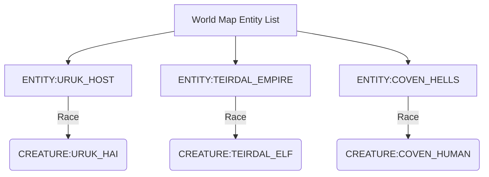

# Mod Design: Tolkien, Diablo and EverQuest

> **Status: proposal, not implemented.** None of the raw files described below
> exist yet (`ls game/raw/objects/ | grep fantasy` returns nothing).
> This is a design document kept for reference; the worldgen presets described
> in the README are the only custom content currently installed.
>
> If you implement it, read `AGENTS.md` section 1 first: raws are CP437, bracket
> matching is unforgiving, and object names must be unique across all files.

This document outlines the design, architecture, and raw configuration templates for a modest Dwarf Fortress mod. The mod introduces new civilizations, megabeasts, and legendary dragons inspired by **Tolkien's Legendarium**, **Diablo (The Burning Hells)**, and **EverQuest (Norrath)**.

---

## 1. Mod Architecture and File Layout

To avoid touching the default game files, all additions will be placed in new, standalone raw files in `game/raw/objects/`:
*   **`creature_fantasy_mod.txt`**: Defines the biology, stats, and attacks for Uruk-Hai, Dark Elves, Cultists, Balrogs, demons, and dragons.
*   **`entity_fantasy_mod.txt`**: Defines the civilizations (Uruk-Hai Host, Teir'Dal Empire, Diablo's Coven).
*   **`item_fantasy_mod.txt`**: Defines custom weapons (such as the Uruk-Hai Scimitar, Fire Whips, and Blood Daggers).

---

## 2. New Civilizations (Entities)

We will introduce three custom civilizations that interact with the world map, send sieges, and trade.



### 2.1. Tolkien: The Uruk Host (`[ENTITY:URUK_HOST]`)
*   **Race**: Uruk-Hai (`[CREATURE:URUK_HAI]`).
*   **Aesthetics**: Heavy iron plate, thick shields, and short, broad blades.
*   **Behavior**: Highly disciplined, militaristic, and aggressive. Hostile to Dwarves and Elves. Unlike normal Goblins, they organize disciplined shield walls and use siege engines.
*   **Draft Raw Configuration**:
    ```text
    [ENTITY:URUK_HOST]
        [SITE_CONTROLLABLE]
        [ALL_MAIN_POPS_CONTROLLABLE]
        [CREATURE:URUK_HAI]
        [TRANSLATION:GOBLIN]
        [BIOME:ANY_LAND]
        [CIV_FORCE_DOMESTICATED]
        [WEAPON:ITEM_WEAPON_SCIMITAR_URUK]
        [WEAPON:ITEM_WEAPON_CROSSBOW]
        [ARMOR:ITEM_ARMOR_BREASTPLATE:COMMON]
        [HELM:ITEM_HELM_HELM:COMMON]
        [MAX_PLAYABLE_POSTS:10]
        [ACTIVE_DIURNAL]
        [SOCIETY_CLASS:MILITARY]
        [ETHIC:KILL_ENEMY:ACCEPTABLE]
        [ETHIC:EAT_SAPIENT:ACCEPTABLE]
        [ETHIC:TORTURE:ACCEPTABLE]
        [ETHIC:SLAVERY:REQUIRED]
        [BABY_CHILD_CAP:100:1000]
        [SITE_CAP:50]
    ```

### 2.2. EverQuest: The Teir'Dal Empire (`[ENTITY:TEIRDAL_EMPIRE]`)
*   **Race**: Dark Elves (`[CREATURE:TEIRDAL_ELF]`).
*   **Aesthetics**: Ornate black-bronze chainmail, poisoned rapiers, and dark robes.
*   **Behavior**: Underworld dwellers (preferring caverns or deep dark forests). Deeply religious (worshipping Innoruuk, Prince of Hate), intelligent, and magically inclined.
*   **Draft Raw Configuration**:
    ```text
    [ENTITY:TEIRDAL_EMPIRE]
        [CREATURE:TEIRDAL_ELF]
        [TRANSLATION:ELF]
        [BIOME:SUBTERRANEAN_CHASM]
        [BIOME:ANY_FOREST]
        [START_BIOME:SUBTERRANEAN_CHASM]
        [WEAPON:ITEM_WEAPON_RAPIER]
        [WEAPON:ITEM_WEAPON_DAGGER]
        [ARMOR:ITEM_ARMOR_MAIL_SHIRT:COMMON]
        [ARMOR:ITEM_ARMOR_ROBE:COMMON]
        [ETHIC:KILL_ENEMY:ACCEPTABLE]
        [ETHIC:TORTURE:ACCEPTABLE]
        [ETHIC:SLAVERY:ACCEPTABLE]
        [SCHOLAR]
        [MAGE]
        [MAGICAL_ITEMS]
        [SITE_CAP:30]
    ```

### 2.3. Diablo: The Coven (`[ENTITY:COVEN_HELLS]`)
*   **Race**: Coven Cultists (`[CREATURE:COVEN_HUMAN]`).
*   **Aesthetics**: Ritual daggers, staves, and leather hoods.
*   **Behavior**: Insane zealots serving the Prime Evils. They launch night raids, deploy poison traps, and use blood magic.
*   **Draft Raw Configuration**:
    ```text
    [ENTITY:COVEN_HELLS]
        [CREATURE:COVEN_HUMAN]
        [TRANSLATION:HUMAN]
        [BIOME:ANY_EVIL]
        [WEAPON:ITEM_WEAPON_DAGGER]
        [WEAPON:ITEM_WEAPON_WHIP]
        [ARMOR:ITEM_ARMOR_VEST:COMMON]
        [HELM:ITEM_HELM_HOOD:COMMON]
        [ETHIC:KILL_ENEMY:REQUIRED]
        [ETHIC:TORTURE:REQUIRED]
        [ETHIC:EAT_SAPIENT:JUSTIFIABLE]
        [MAX_LEVEL:10]
    ```

---

## 3. New Biological Templates (Creatures)

To support the civilizations, we must define their base creature biologies.

### 3.1. Uruk-Hai (`[CREATURE:URUK_HAI]`)
*   Based on humans but stronger, immune to sunlight sickness, and possess high pain tolerance.
*   **Key Tags**:
    *   `[PHYS_ATT_RANGE:STRENGTH:1250:1750:2250]` (Highly muscular)
    *   `[PHYS_ATT_RANGE:TOUGHNESS:1250:1750:2250]` (Resilient to injury)
    *   `[NO_SUN_SICKNESS]` (Tolkien lore: Saruman bred them to ignore sunlight)

### 3.2. Teir'Dal Elf (`[CREATURE:TEIRDAL_ELF]`)
*   Lean, highly agile, with dark blue/purple skin and white hair. Possess night vision.
*   **Key Tags**:
    *   `[PHYS_ATT_RANGE:AGILITY:1500:2000:2500]` (Extremely quick)
    *   `[MENTAL_ATT_RANGE:ANALYTICAL_ABILITY:1500:2000:2500]` (Magical potential)
    *   `[NIGHT_VISION:2]` (Adapted to Neriak's subterranean caverns)

---

## 4. Megabeasts, Titans, and Dragons

These legendary creatures will roam the world generation, destroy civilizations, and occasionally siege late-game fortresses.

| Creature | Source | Class | Special Weapon/Attack |
|---|---|---|---|
| **Durin's Bane** | Tolkien | Megabeast | Fire whip, Fire aura, Darkness shroud |
| **Ancalagon the Black** | Tolkien | Titan Dragon | Cataclysmic Firebreath (can melt stone) |
| **The Butcher** | Diablo | Megabeast | Fleshhook pull, cleaver attack, rage speed |
| **Diablo (Lord of Terror)** | Diablo | Titan | Terror syndrome (fear/panic), bone prison |
| **Lady Vox** | EverQuest | Megabeast Dragon | Frost breath, freezing syndrome |
| **Kerafyrm (The Sleeper)** | EverQuest | Ultimate Titan | Prismatic breath (multiple damage types), high armor |

### 4.1. Tolkien: Durin's Bane (Balrog) (`[CREATURE:BALROG]`)
A demon of shadow and flame. Imposes fear and burns everything around it.
*   **Draft Raws**:
    ```text
    [CREATURE:BALROG]
        [DESCRIPTION:A demon of shadow and flame, wielding a whip of fire.]
        [NAME:balrog:balrogs:balrog]
        [MEGABEAST]
        [REGENERATION]
        [NO_THOUGHT_CENTER_FOR_MOVEMENT]
        [PREFSTRING:shadow and flame]
        [BODY:HUMANOID_NECK:2EYES:2EARS:NOSE:2LUNGS:HEART:GUTS:SPINE:BRAIN:SKULL:MOUTH:RIBCAGE:WING]
        [USE_MATERIAL_TEMPLATE:FIRE:FIRE_TEMPLATE]
        [ACTIVE_DIURNAL][ACTIVE_NOCTURNAL]
        [BODY_SIZE:0:0:5000000]
        [EXTINGUISH_FIRE_WITH_HEAT:12000]
        [SPEC_HEAT:100]
        [HEAT_AURA:11000] # Emits heat that ignites nearby objects
        [ATTACK:BLUNT:100:1000:strike:strikes:fist:1200]
        [ATTACK:BURN:500:5000:lash:lashes:fire whip:1500]
    ```

### 4.2. Tolkien: Ancalagon the Black (`[CREATURE:ANCALAGON]`)
The largest dragon in Middle-earth history. His fire is hot enough to melt rings of power.
*   **Draft Raws**:
    ```text
    [CREATURE:ANCALAGON]
        [DESCRIPTION:The black colossus of Morgoth, a dragon of size beyond comprehension.]
        [NAME:Ancalagon:Ancalagon:Ancalagon]
        [TITAN]
        [FOLIAGE_DESTROYER]
        [BUILDING_DESTROYER:2]
        [BODY_SIZE:0:0:50000000] # Massive scale (50 tons+)
        [BODY:DRAGON:2EYES:2LUNGS:HEART:SPINE:BRAIN:SKULL:MOUTH:2WINGS]
        [MATERIAL_BREATH:LOCAL_CREATURE_MAT:FIRE:BREATH_ATTACK] # Stone-melting firebreath
        [SELECT_MATERIAL:FIRE]
            [MAT_BREATH_TEMPERATURE:20000] # Melt temperature threshold
    ```

### 4.3. Diablo: The Butcher (`[CREATURE:BUTCHER_DEMON]`)
A large, bloated demon that loves fresh meat. Charges and causes heavy bleeding.
*   **Draft Raws**:
    ```text
    [CREATURE:BUTCHER_DEMON]
        [DESCRIPTION:A grotesque, massive demon covered in blood, dragging a hook and a cleaver.]
        [NAME:the butcher:the butchers:butcher]
        [MEGABEAST]
        [FLESH]
        [BODY_SIZE:0:0:1000000]
        [BODY:HUMANOID_NECK:2EYES:MOUTH:RIBCAGE:GUTS:HEART:2LUNGS:SPINE:BRAIN:SKULL]
        [ATTACK:EDGE:50000:8000:cleave:cleaves:giant cleaver:2000]
            [SPECIAL_ATTACK_SEVER_LIP]
    ```

### 4.4. EverQuest: Lady Vox (`[CREATURE:LADY_VOX]`)
An ancient white dragon residing in Permafrost. Freezes dwarves solid.
*   **Draft Raws**:
    ```text
    [CREATURE:LADY_VOX]
        [DESCRIPTION:The legendary white dragon of the Permafrost caverns.]
        [NAME:Lady Vox:Lady Vox:Lady Vox]
        [MEGABEAST]
        [BODY_SIZE:0:0:12000000]
        [BODY:DRAGON:2EYES:2LUNGS:HEART:SPINE:BRAIN:SKULL:MOUTH:2WINGS]
        [MATERIAL_BREATH:LOCAL_CREATURE_MAT:FROST:BREATH_ATTACK]
        [USE_MATERIAL_TEMPLATE:FROST:FROSTbite_TEMPLATE] # Frostbite syndrome breath
    ```

---

## 5. Summary Recommendation for Modding Execution

To activate this mod in your game:
1.  **Create the custom raws** as drafted above in `game/raw/objects/`.
2.  **Add the items** (Scimitars, Fire Whips) to a new `item_fantasy_mod.txt` file so the Uruk and Teir'Dal civilizations can spawn them correctly.
3.  **Generate a new world** using the `TOLKIEN_EPIC_LARGE` world-generation preset. This preset's high savagery and evil biomes will provide perfect habitats for the new megabeasts and ensure the civilizations clash immediately.
