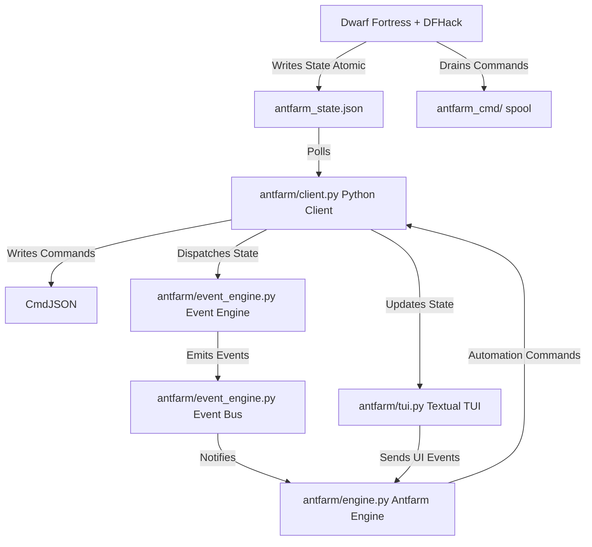

# Dwarf Fortress Modding & Configuration Audit

This report provides a full audit of the Dwarf Fortress directory structure (specifically tailored for version **0.47.05-r8** with DFHack). It outlines the core modding systems, identifies the key configuration knobs, and explains how to edit creatures, civilizations, items, materials, and game engine settings.

---

## 1. Directory Structure Overview

The game lives in `game/`, the Antfarm companion in `antfarm/`, and the bundled utilities in `tools/`. See the README for the full layout. The directories that matter for modding and configuration:

*   **`game/raw/objects/`**: The core data directory where all game objects (creatures, items, materials, entities/civilizations, plants, and languages) are defined. These are text-based raw files that specify the simulation rules.
*   **`game/data/init/`**: Holds initialization configurations, game controls, display settings, color palettes, announcements, and world gen presets.
*   **`game/dfhack-config/init/onMapLoad.init`**: Fortress automation, applied on every map load. This is where standing automation belongs. (`game/dfhack.init` runs earlier, before any world is loaded, and is only for things that must happen at DFHack startup.)

---

## 2. Raw Objects Audit (`game/raw/objects/`)

Dwarf Fortress uses a custom declarative syntax enclosed in square brackets `[...]`. The raw files are loaded at startup (and compiled into world saves). Modifying files here affects new worlds (or existing saves if edited inside the save folder's `raw` directory).

### 2.1. Creatures (`creature_*.txt`)
Creature raw files define the biology, attributes, castes, sizing, and behaviors of every animal and intelligent race in the game.
*   **Key Files**:
    *   [creature_standard.txt](file:///home/ekco/github/dwarffortress/game/raw/objects/creature_standard.txt) (contains Dwarves, Elves, Humans, Goblins, Kobolds)
    *   [creature_domestic.txt](file:///home/ekco/github/dwarffortress/game/raw/objects/creature_domestic.txt) (livestock, pets, and pack animals)
    *   [creature_subterranean.txt](file:///home/ekco/github/dwarffortress/game/raw/objects/creature_subterranean.txt) (underground wildlife, cave crocodiles, etc.)
*   **Example Block (`[CREATURE:DWARF]`)**:
    *   `[CREATURE:DWARF]` declares the creature ID.
    *   `[INTELLIGENT]`/`[CAN_LEARN]`/`[CAN_SPEAK]`: Gives creatures human-like cognition, enabling social interactions, skill progression, and civ participation.
    *   `[STRANGE_MOODS]`: Allows dwarves to enter strange moods and craft artifacts.
    *   `[BODY:HUMANOID_NECK:...]`: Links body templates (limbs, organs, joints) defined in `body_default.txt`.
    *   `[BODY_DETAIL_PLAN:...]`: Standardizes tissue structures (skin, muscle, bone, fat).
    *   `[BABY:1][CHILD:12]`: Determines maturation ages.
    *   `[PREFSTRING:beards]`: Determines what other creatures like about them.

### 2.2. Civilizations & Entities (`entity_default.txt`)
Entities define the political structure, weapons/armor permissions, ethics, and cultural values of civilizations.
*   **Key File**: [entity_default.txt](file:///home/ekco/github/dwarffortress/game/raw/objects/entity_default.txt)
*   **Key Modding Tags**:
    *   `[ENTITY:MOUNTAIN]` (Dwarves), `[ENTITY:PLAINS]` (Humans), `[ENTITY:FOREST]` (Elves), `[ENTITY:EVIL]` (Goblins).
    *   `[SITE_CONTROLLABLE]`: Allows the player to play as this civilization in fortress mode.
    *   `[CREATURE:DWARF]`: Associates the entity with a biological creature template.
    *   `[WEAPON:ITEM_WEAPON_AXE_BATTLE]`/`[ARMOR:ITEM_ARMOR_BREASTPLATE]`: Specifies what items this civ can craft and equip.
    *   `[ETHIC:KILL_ENEMY:PUNISH]`: Defines laws and cultural taboos (e.g., eating enemies, slavery, theft). These trigger diplomat conflicts and wars.
    *   `[SCHOLAR]` / `[POET]` / `[MUSICIAN]`: Enables cultural jobs and libraries.

### 2.3. Items (`item_*.txt`)
Item raw files determine the stats, size, skill mapping, and characteristics of weapons, armor, tools, and clothing.
*   **Key Files**:
    *   [item_weapon.txt](file:///home/ekco/github/dwarffortress/game/raw/objects/item_weapon.txt) (swords, axes, war hammers, whips)
    *   [item_armor.txt](file:///home/ekco/github/dwarffortress/game/raw/objects/item_armor.txt) (breastplates, mail shirts)
    *   [item_helm.txt](file:///home/ekco/github/dwarffortress/game/raw/objects/item_helm.txt), [item_pants.txt](file:///home/ekco/github/dwarffortress/game/raw/objects/item_pants.txt), [item_gloves.txt](file:///home/ekco/github/dwarffortress/game/raw/objects/item_gloves.txt), [item_shoes.txt](file:///home/ekco/github/dwarffortress/game/raw/objects/item_shoes.txt)
    *   [item_ammo.txt](file:///home/ekco/github/dwarffortress/game/raw/objects/item_ammo.txt) (bolts, arrows)
    *   [item_tool.txt](file:///home/ekco/github/dwarffortress/game/raw/objects/item_tool.txt) (nest boxes, hives, minecarts, wheelbarrows)
*   **Key Modding Tags**:
    *   `[SIZE:800]`: Determines weight and encumbrance.
    *   `[TWO_HANDED:47500]`/`[MINIMUM_SIZE:42500]`: Restricts one-handed use based on user creature size (measured in cubic centimeters).
    *   `[ATTACK:EDGE:40000:6000:hack:hacks:NO_SUB:1250]`: Format is `[ATTACK:type:contact_area:penetration:verb_2nd:verb_3rd:noun:velocity_multiplier]`. Edged weapons slash (high contact/penetration), while blunt weapons crush bone (velocity multiplier).

### 2.4. Inorganics & Materials (`inorganic_*.txt` & `material_template_default.txt`)
Defines the physical properties of metals, stone types, gems, and soil.
*   **Key Files**:
    *   [inorganic_metal.txt](file:///home/ekco/github/dwarffortress/game/raw/objects/inorganic_metal.txt) (iron, steel, copper, adamantine)
    *   [inorganic_stone_gem.txt](file:///home/ekco/github/dwarffortress/game/raw/objects/inorganic_stone_gem.txt), [inorganic_stone_mineral.txt](file:///home/ekco/github/dwarffortress/game/raw/objects/inorganic_stone_mineral.txt)
*   **Key Modding Tags**:
    *   `[MELTING_POINT:...]`/`[BOILING_POINT:...]`: Controls phase changes. Low melting points allow weapons to melt in magma.
    *   `[SOLID_DENSITY:...]`: Determines the weight of items made from the material.
    *   `[IMPACT_YIELD:...]`/`[IMPACT_FRACTURE:...]`/`[SHEAR_YIELD:...]`: Specifies physical tensile strength, hardness, and durability. Dictates if a metal makes good armor or sharp blades.

### 2.5. Plants & Vegetation (`plant_*.txt`)
Defines subterranean and surface flora, crops, and trees.
*   **Key Files**:
    *   [plant_crops.txt](file:///home/ekco/github/dwarffortress/game/raw/objects/plant_crops.txt) (Plump Helmets, Pig Tail, Cave Wheat)
    *   [plant_standard.txt](file:///home/ekco/github/dwarffortress/game/raw/objects/plant_standard.txt) (surface crops and wild plants)
*   **Key Modding Tags**:
    *   `[GROWDUR:500]`: Controls the time it takes for a crop to grow. Lower values increase harvest frequency.
    *   `[USE_MATERIAL_TEMPLATE:STRUCTURAL:STRUCTURAL_PLANT_TEMPLATE]`: Determines edible components.
    *   `[DRINK:Plump Helmet Wine:ITEM_FOOD_NONE:PLANT_ALCOHOL_CREATOR]`: Specifies if the plant can be brewed into alcohol.

---

## 3. Configuration & Initialization Files (`game/data/init/`)

These configuration files define video, audio, rendering, controls, and active gameplay engine parameters.

### 3.1. Gameplay Configuration (`d_init.txt`)
Contains the primary simulation parameters.
*   **Key File**: [d_init.txt](file:///home/ekco/github/dwarffortress/game/data/init/d_init.txt)
*   **Key Settings (Knobs)**:
    *   `[POPULATION_CAP:200]`: Limits hard migrant arrivals.
    *   `[STRICT_POPULATION_CAP:220]`: Limits birth rates and visitor migration once reached.
    *   `[BABY_CHILD_CAP:100:1000]`: Limits children (`[MaxChildren:Max%OfAdults]`).
    *   `[AUTOSAVE:SEASONAL]`: Options: `NONE`, `SEASONAL`, `YEARLY`.
    *   `[AUTOBACKUP:YES]`: Backs up saves automatically on save.
    *   `[TEMPERATURE:YES]`: Turning this to `NO` boosts FPS by turning off heat/cold transfers.
    *   `[WEATHER:YES]`: Turning this to `NO` disables rain and wind, saving CPU cycles.
    *   `[CAVEINS:YES]`: Toggles collapse physics for unsupported roofs.
    *   `[INVADERS:YES]`: Toggles goblin sieges, beast attacks, and titan arrivals.
    *   `[GRAVEYARD:YES]`: Enables ghost encounters for unburied corpses.

### 3.2. Graphics, Audio & Controls (`init.txt`)
Configures the graphics engine, sound, and windowing system.
*   **Key File**: [init.txt](file:///home/ekco/github/dwarffortress/game/data/init/init.txt)
*   **Key Settings (Knobs)**:
    *   `[SOUND:ON]`: Toggles game music and audio.
    *   `[PRINT_MODE:2D]`: Controls the renderer. **Leave this alone.** `TWBT` segfaults
        `libgraphics.so` on modern Linux drivers (its plugin is renamed `.disabled` for
        that reason), and `STANDARD` hangs the game behind a modal GTK dialog when OpenGL
        buffer negotiation fails on modern Mesa. See AGENTS.md 6.2.2 and 6.2.6.
    *   `[FPS:YES]`/`[FPS_CAP:100]`: Shows FPS and caps calculation speed.
    *   `[G_FPS_CAP:50]`: Caps graphics rendering speed (keeps it fluid while saving resources).
    *   `[ZOOM_SPEED:10]`: Adjusts mouse wheel sensitivity.

### 3.3. Color Palette Configuration (`colors.txt`)
Defines the RGB values for the 16 basic colors used in the console display.
*   **Key File**: [colors.txt](file:///home/ekco/github/dwarffortress/game/data/init/colors.txt)

---

## 4. DFHack Automation and Plugins (`game/dfhack.init`)

DFHack injects custom code into the running executable to patch bugs, add overlay interfaces, and automate tedious chores.
*   **Key File**: [dfhack.init](file:///home/ekco/github/dwarffortress/game/dfhack.init)
*   **Tweakable Plugins & Commands**:
    *   `autobutcher`: Automates management of livestock populations.
    *   `fastdwarf`: Speeds up dwarves' work/walk rate (`fastdwarf 1 0` or `fastdwarf 1 1`).
    *   `copypaste`: Enables copy-pasting layouts and orders.
    *   `digmode`: Adds designation options like circles and authed diagonals.
    *   `autofarm`: Automates crop planting based on seed stocks.
    *   `keybinding`: Rebinds DFHack overlay shortcuts.

---

## 5. Summary Cheat-Sheet: Common Modding Needs

| Goal | Target File | Action |
|---|---|---|
| **Increase FPS** | `d_init.txt` | Set `[WEATHER:NO]`. **Do NOT set `[TEMPERATURE:NO]`** on a save with magma, fire, ice or melt jobs -- DF dereferences null temperature structures and segfaults within seconds of unpausing (AGENTS.md 6.2.1). Prefer `[FPS_CAP]`/`[G_FPS_CAP]` and a lower `POPULATION_CAP`. |
| **Stop Sieges** | `d_init.txt` | Set `[INVADERS:NO]` |
| **Change Max Citizens** | `d_init.txt` | Modify `[POPULATION_CAP:200]` and `[STRICT_POPULATION_CAP:220]` |
| **Abundant Ores** | `world_gen.txt` | Set `[MINERAL_SCARCITY:100]` (or `500`) |
| **Make Elves Eat Corpses** | `entity_default.txt` | Change `[ETHIC:EAT_SAPIENT:UNTHINKABLE]` to `[ETHIC:EAT_SAPIENT:ACCEPTABLE]` |
| **Brew Golden Cup Wine** | `plant_crops.txt` | Edit Plump Helmet raw tags or brew duration |
| **God-like Dwarves** | `creature_standard.txt` | Add body/strength flags under `[CREATURE:DWARF]` |
| **Super Weapons** | `item_weapon.txt` | Increase size, contact area, or velocity multiplier |

---

## 6. Linux Compatibility and Custom Tuning

To ensure seamless execution on modern Linux environments, the following custom system-level patches and parameters have been applied:

### 6.1. OpenGL Symbol Conflict Fix
*   **Problem**: The game crashed with a `symbol lookup error: libgraphics.so: undefined symbol: glXGetProcAddressARB` when run.
*   **Solution**: Modified the launcher scripts [df](file:///home/ekco/github/dwarffortress/game/df) and [dfhack](file:///home/ekco/github/dwarffortress/game/dfhack) to explicitly preload `libGL.so.1` in the `LD_PRELOAD` path, ensuring the dynamic linker can resolve GLX symbols successfully.

### 6.2. Single-Buffering Warning Suppression
*   **Problem**: OpenGL initialization warns that single-buffering is unavailable under modern X11 compositors, popping up three modal dialog boxes on startup and freezing/interrupting window resizing with subsequent dialogs.
*   **Solution**: Compiled a custom helper library `libs/libsuppressdialog.so` that hooks GTK dialog functions. When a warning dialog box for single-buffering is created, the helper automatically intercepts it, logs the warning to standard output/error, and answers `OK` in the background without creating a visible modal popup. This helper is included in the launcher preloads.

### 6.3. Elevation Rejection Mitigation
*   **Problem**: Mountainous custom presets (like `TOLKIEN_EPIC`) and island presets frequently failed generation due to `HIGH ELEVATION REJECTION` when the generator was unable to satisfy high minimum bounds for terrain elevations.
*   **Solution**: Relaxed the minimum high-elevation constraints (`[ELEVATION_RANGES]`) in [world_gen.txt](file:///home/ekco/github/dwarffortress/game/data/init/world_gen.txt) and the LNP baseline:
    *   `TOLKIEN_EPIC_LARGE`: Reduced high-elevation minimum squares from `21024` to `4000`.
    *   `TOLKIEN_EPIC_MEDIUM`: Reduced high-elevation minimum squares from `5320` to `1000`.
    *   Islands (Medium, Small, Smaller, Pocket): Reduced corresponding constraints to eliminate rejections while preserving the topographical layout.

---

## 7. DF Companion TUI & "Antfarm Mode" Automation

We have implemented a dual-component companion system consisting of an aesthetic Terminal User Interface (TUI) stream overlay and an automated camera/automation engine ("Antfarm Mode").

### 7.1. Architectural Overview



1.  **DFHack Lua Script ([antfarm_server.lua](file:///home/ekco/github/dwarffortress/game/hack/scripts/antfarm_server.lua))**:
    *   Runs as a non-blocking background loop in DFHack (using `dfhack.timeout`).
    *   Periodically extracts the active or followed dwarf's detailed attributes, skills, current action, location, recent memories/emotions, and unsatisfied needs.
    *   Collects general fortress stats (FPS, season, year, population), the full citizen roster, and the last 5 active fortress announcements/status reports.
    *   Atomically writes the gathered state to `antfarm_state.json`.
    *   Drains one-command-per-file from the `antfarm_cmd/` spool directory, allowing camera
        focusing/following, nicknames, probes, guided-build control and arbitrary DFHack commands.
        (The single `antfarm_cmd.json` file shown in the diagram above was protocol 1; it is still
        read for hand-written one-shots but cannot carry concurrent commands. See AGENTS.md 5.2.)
    *   Leverages the game's native tracking system by setting the global `df.global.ui.follow_unit` variable to keep the camera locked onto followed citizens smoothly.
2.  **Python IPC Client ([client.py](file:///home/ekco/github/dwarffortress/antfarm/client.py))**:
    *   Provides a clean, thread-safe wrapper that polls the atomic state file and writes commands to the command file.
    *   Decouples the Python runtime from game network code, eliminating standard TCP socket blockage and native crash risks.
3.  **Event Engine & Event Bus ([event_engine.py](file:///home/ekco/github/dwarffortress/antfarm/event_engine.py))**:
    *   **Module 0 (Event Engine)**: Compares state changes between ticks and publishes structured events (`CitizenStartedJob`, `CitizenEnteredCombat`, `CitizenStressIncreased`, `CitizenDeath`, `FortressAnnouncement`) onto a unified wildcard-supporting `EventBus`.
4.  **Antfarm Engine ([antfarm.py](file:///home/ekco/github/dwarffortress/antfarm/engine.py))**:
    *   Launches a comprehensive DFHack automation suite on boot: `autolabor`, `prioritize`, `autobutcher`, `workflow`, `seedwatch`, `buildingplan`, `tailor`, `autofarm`, `autochop`, `autotrade`, `automelt`. Also configures recurring maintenance via `repeat` (clothing cleanup, order sorting, starvation warnings, stack consolidation).
    *   Controls camera rotation:
        *   `director` mode (Default): Runs as a nature documentary director, subscribing to the `EventBus` and calculating time-based exponentially decaying interest scores for each citizen ($interest(t) = \sum W_e \times 2^{-\Delta t / HL_e}$). Locks onto the most interesting target using a hysteresis threshold barrier of $H = 150$.
        *   `timed` mode: Cycles focus every 15 seconds through the top 5 highest interest-scoring citizens.
        *   `event` mode: Legacy mode that snaps camera focus to highly stressed citizens or dwarves in a strange mood.
        *   `idle` mode: Camera follow is disabled, letting the TUI track the user's manual in-game cursor.
5.  **TUI Stream Dashboard ([tui.py](file:///home/ekco/github/dwarffortress/antfarm/tui.py))**:
    *   Built using `textual` to render a broadcast-grade HUD dashboard fit for Twitch streaming.
    *   Incorporates OBS safe padding, a dedicated horizontal Story Card, Director mode stats banner, stress sparkline graphs, and needs gauges.
    *   Cross-references historical figure IDs against `legends.db` (SQLite) to fetch nobility titles, birth dates, and family trees.
6.  **Simulation Knowledge Graph ([knowledge_graph.py](file:///home/ekco/github/dwarffortress/antfarm/knowledge_graph.py))**:
    *   **Module 13 (Simulation Knowledge Graph)**: Maintains a live semantic graph representation of character relationships, items, and locations. Exposes a BFS shortest path finder to dynamically discover paths between characters and events.
7.  **Plugin SDK ([sdk.py](file:///home/ekco/github/dwarffortress/antfarm/sdk.py))**:
    *   **Module 24 (Plugin SDK)**: Exposes a base plugin structure and dynamic plugin manager to allow loading/unloading custom hooks and widgets at runtime.
8.  **Self-Healing Camera Control**:
    *   The Lua server implements a 5-second heartbeat timeout. If no commands are received from the Python TUI for 5 seconds, the server automatically releases the camera lock (`df.global.ui.follow_unit = -1`), returning full manual camera control to the player. The Python engine sends periodic heartbeat pings to maintain the lock while active.

### 7.2. Usage and Controls

1.  **Start Dwarf Fortress**:
    Launch the game using `./dfhack`.
2.  **Start the Server**:
    The IPC server script loads automatically when you load a save (configured in `dfhack-config/init/onLoad.init`).
3.  **Launch the Dashboard**:
    Open a terminal in the root workspace and run:
    ```bash
    ./.venv/bin/python -m antfarm.tui
    ```
4.  **TUI Hotkeys**:
    *   `d`: Switch to **Director AI** mode (Nature Documentary mode - follows highest interest scoring dwarf automatically).
    *   `t`: Switch to **Timed** rotation mode (cycles through top 5 highest interest scoring dwarfs).
    *   `e`: Switch to **Event-Driven** rotation mode.
    *   `i`: Switch to **Idle** mode (follows selected unit).
    *   `r`: Force immediate camera rotation to the next citizen (only in Timed mode).
    *   `q`: Quit the dashboard.

